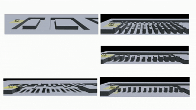

# MARG: MAstering Risky Gap Terrains for Legged Robots with Elevation Mapping #

[comment]: <> (  <h2 align="center">PAPER</h2>)
  <h3 align="center">
    <a href="https://astrorix.github.io/MARG/">Project Website</a> 
  | <a href="https://youtu.be/cVeQD845ER0">Youtube Video</a> 
  </h3>


<div align="center">

</div>

<div align="center">


</div>


## Abstract ##
Deep Reinforcement Learning (DRL) controllers for quadrupedal locomotion have demonstrated impressive performance on challenging terrains, allowing robots to execute complex skills such as climbing, running, and jumping. However, existing blind locomotion controllers often struggle to ensure safety
and efficient traversal through risky gap terrains, which are typically highly complex, requiring robots to perceive terrain information and select appropriate footholds during locomotion accurately. Meanwhile, existing perception-based controllers still present several practical limitations, including a complex multi-sensor deployment system and expensive computing resource requirements. This paper proposes a DRL controller named MAstering Risky Gap Terrains (MARG), which integrates terrain maps and proprioception to dynamically adjust the action and enhance the robot's stability in these tasks. During the training phase, our controller accelerates policy optimization by selectively incorporating privileged information (e.g., center of mass, friction coefficients) that are available in simulation but unmeasurable directly in real-world deployments due to sensor limitations. We also designed three foot-related rewards to encourage the robot to explore safe footholds. More importantly, a terrain map generation (TMG) model is proposed to reduce the drift existing in mapping and provide accurate terrain maps using only one LiDAR, providing a foundation for zero-shot transfer of the learned policy. The experimental results indicate that MARG maintains stability in various risky terrain tasks.
## Code Structure ##

### Code Coming Soon

### Installation
1. Create a new python virtual env with python 3.6, 3.7 or 3.8 (3.8 recommended)
2. Install pytorch 1.10 with cuda-11.3:
    - `conda install pytorch==2.3.1 torchvision==0.18.1 torchaudio==2.3.1 pytorch-cuda=12.1 -c pytorch -c nvidia`
3. Install Isaac Gym
   - Download and install Isaac Gym Preview 3 (Preview 2 will not work!) from https://developer.nvidia.com/isaac-gym
   - `cd isaacgym/python && pip install -e .`
   - Try running an example `cd examples && python 1080_balls_of_solitude.py`
   - For troubleshooting check docs `isaacgym/docs/index.html`
4. Install rsl_rl (PPO implementation)
   - Clone https://github.com/leggedrobotics/rsl_rl
   -  `cd rsl_rl && pip install -e .` 
5. Install Risky_gym
   - Clone this repository
   - `pip install -e .`
   - `pip install -r requirement-gpu.txt`

### Usage
1. Train:  
  ```python legged_gym/legged_gym/script/train.py --task=go1 --num_envs=4096```
    -  To run on CPU add following arguments: `--sim_device=cpu`, `--rl_device=cpu` (sim on CPU and rl on GPU is possible).
    -  To run headless (no rendering) add `--headless`.
    - **Important**: To improve performance, once the training starts press `v` to stop the rendering. You can then enable it later to check the progress.
    - The trained policy is saved in `issacgym_anymal/logs/<experiment_name>/<date_time>_<run_name>/model_<iteration>.pt`. Where `<experiment_name>` and `<run_name>` are defined in the train config.
    -  The following command line arguments override the values set in the config files:
     - --task TASK: Task name.
     - --resume:   Resume training from a checkpoint
     - --experiment_name EXPERIMENT_NAME: Name of the experiment to run or load.
     - --run_name RUN_NAME:  Name of the run.
     - --load_run LOAD_RUN:   Name of the run to load when resume=True. If -1: will load the last run.
     - --checkpoint CHECKPOINT:  Saved model checkpoint number. If -1: will load the last checkpoint.
   
2. Play a trained policy:  
```python legged_gym/legged_gym/script/play.py --task=go1```
    - By default the loaded policy is the last model of the last run of the experiment folder.
    - Other runs/model iteration can be selected by setting `load_run` and `checkpoint` in the train config.
3. Play a trained policy with Joystick:
```python legged_gym/legged_gym/script/play_joy.py --task=go1```

